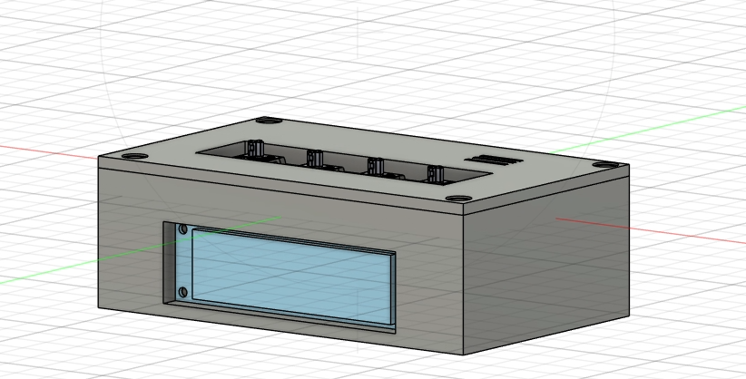
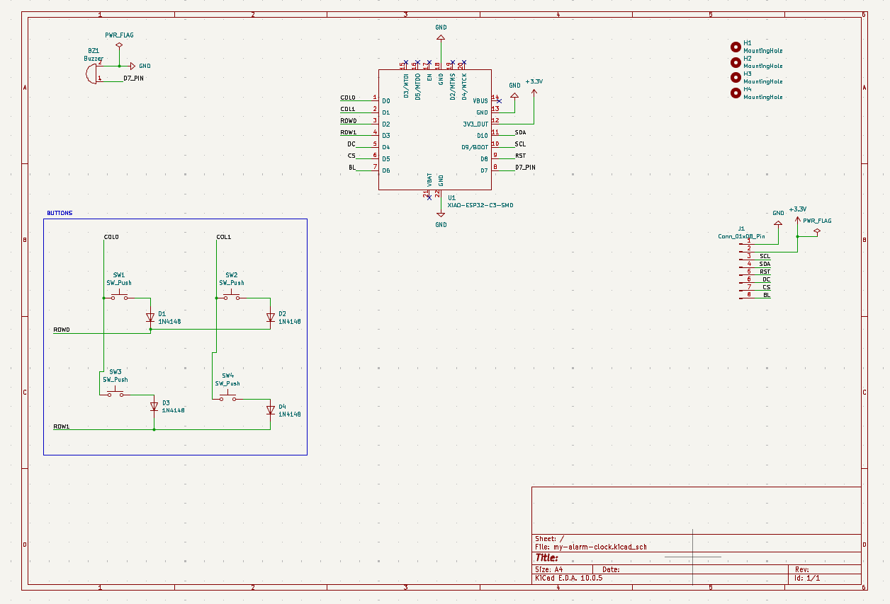
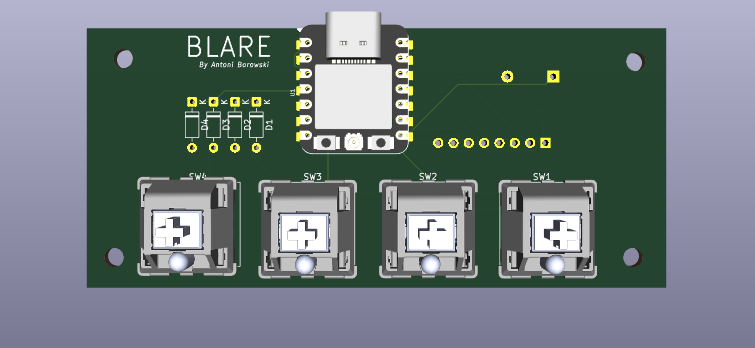

# My-alarm-clock (Blare)

My alarm clock is my own alarm clock with a lot of modern functions! 
It uses NTP servers to get correct time, it can bring you some information like weather for today and it will do futher more!

## Features:
 - 3D printed case with holes for screen and 4 keys
 - 2.25in TFT display
 - 4 keys for setting time to wake up and navigate through the menu!

## CAD Model
The top of case and bottom fits together using 4 M3 bolts. For PCB it's also 4 M3 bolt and for the screen it's 2 M2 bolts.
It was made in Fusion360.

## PCB
The PCB was designed in KiCad. I added some 3D models to make the visualization more closely resemble how the PCB will look in the real world.
This also makes the CAD design process easier.

Schematic

PCB

## Firmware
I've used Arduino framework to make software designing process more easier.

Functions that firmware have is:
  - Menu for set alarm to wake up you!
  - Connection with NTP server through WiFi
  - In the future it will have module to present you today's weather!

## BOM
Here should be everything you need to make this alarm clock!

- 1x Seeed XIAO ESP32C3
- 1x 2.25in TFT Screen
- 1x 3.3V Piezo Buzzer
- 4x Keyboard Switches and Keycaps
- 4x 1N4148 Diodes
- 8x M3x8mm Screws
- 8x M3x5x4 Heatset Inserts
- 2x M2×3 mm Heatset Inserts
- 2x M2×3 mm Screws
- 8x 20cm Female-Female Jumper Wires
- 1x 2.54mm 8 Pin Male Header
- 1x Case ( 2 printed parts )
- 1x SMA Female to U.FL Adapter
- 1x WiFi Antena

## Extra stuff
[Here is a site where RAM prices haven't gone up](https://youtu.be/ZZ5LpwO-An4?t=2)
